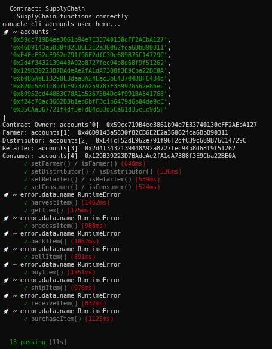
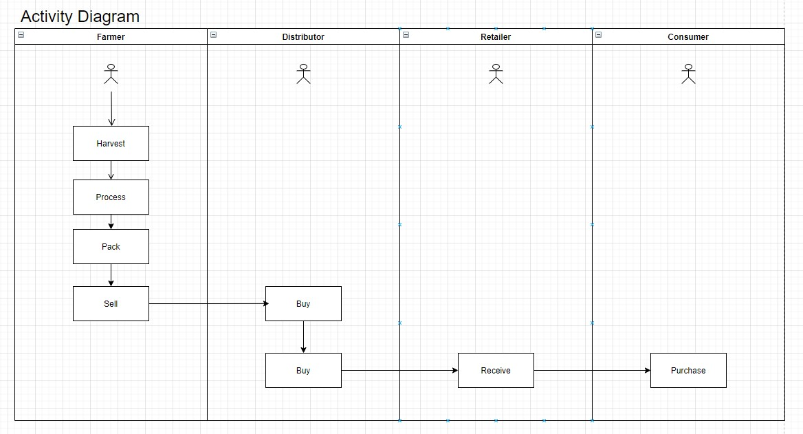
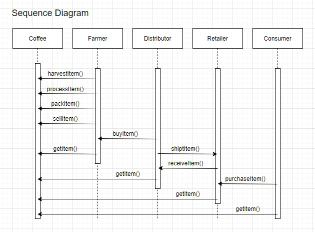
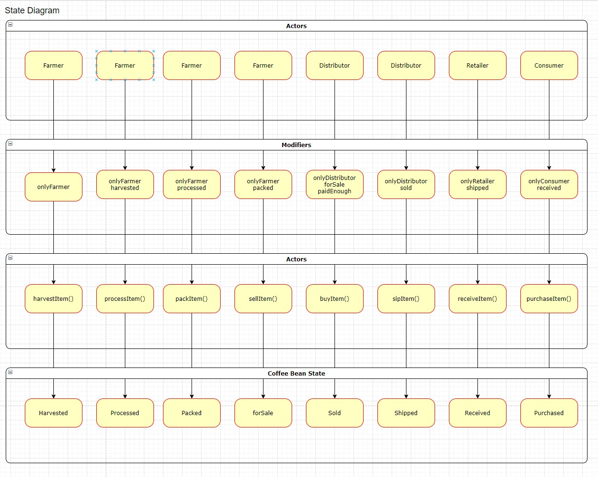
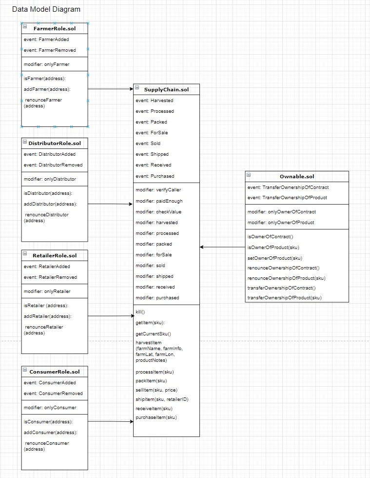

# Product Tracking Dapp
My Version of Udacity Supply Chain Dapp

## App deployed on Netlify
https://coffeesupplychain.netlify.app/
## See contract on Rinkeby
https://rinkeby.etherscan.io/address/0x1b4D8b9bb36C5EDF0580ADF50E73FF255e3dd8d3

## App Summary
You can :
- Assign yourself roles.
- Carry out actions on crops depending on your role and whether you own the crop in question.
- See details of a crop.
- See the full transaction history of the contract.
- Transfer stars to another address.
- Put stars up for sale.
- Buy stars that are available for sale.
- Options change depending on whether you are the owner of the star that is listed.

## Tests
- Mocha for contract tests
- Errors visible in console logs are confirming failure when account with wrong permissions attempts an action.
- [See Tests Here](https://github.com/richardmands/supplyChain/blob/master/test/TestSupplychain.js)

## UML
### Activity Diagram

### Sequence Diagram

### State Diagram

### Data-Model Diagram

## Libraries
- Truffle v5.3.6
- Solidity v0.8.0
- Web3 v1.3.0
- Node v14

- Create React App for App Base
- Local development carried out with Ganache

## IPFS
- Not Used